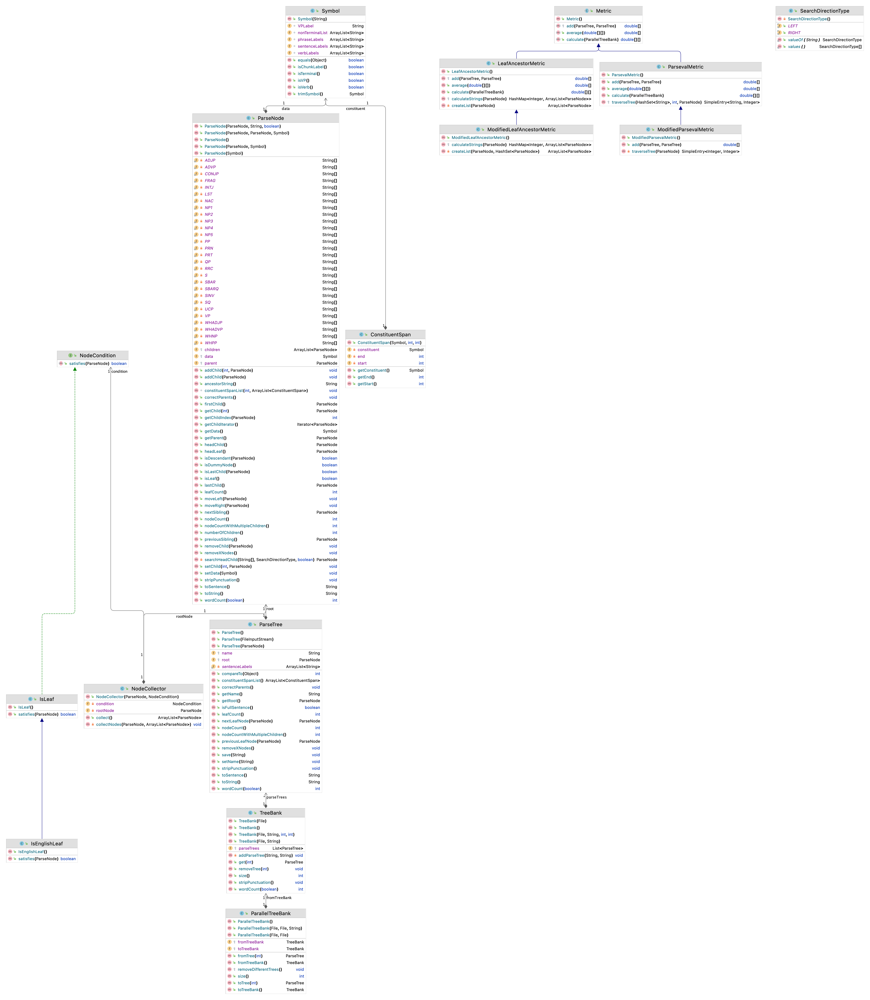

Constituency TreeBanks
============

When one talks about the “success” of a Natural Language Processing solution, they often refer to its ability to analyse the semantic and syntactic structure of a given sentence. Such a solution is expected to be able to understand both the linear and hierarchical order of the words in a sentence, unveil embedded structures, illustrate syntactical relationships and have a firm grasp of the argument structure. In order to meet the expectations, cutting edge Natural Language Processing systems like parsers, POS taggers or machine translation systems make use of syntactically or semantically annotated treebanks. Such treebanks offer a deep look through the surface and into the logical form of sentences.

Annotated treebanks can be categorised as constituency treebanks and dependency treebanks. Constituency treebanks offers clarity through resolving structural ambiguities, and successfully illustrates the syntagmatic relations like adjunct, complement, predicate, internal argument, external argument and such. 

The very first comprehensive annotated treebank, the Penn Treebank, was created for the English language and offers 40,000 annotated sentences. Following the Penn Treebank, numerous treebanks annotated for constituency structures were developed in different languages including French, German, Finnish, Hungarian, Chinese and Arabic.

Video Lectures
============

[](https://youtu.be/fY8tn8ny0m4)[](https://youtu.be/aNGrV3DkzAg)[](https://youtu.be/78KXo9tHcqQ)

For Developers
============

You can also see [Python](https://github.com/starlangsoftware/ParseTree-Py), [Cython](https://github.com/starlangsoftware/ParseTree-Cy), [C](https://github.com/starlangsoftware/ParseTree-C), [C++](https://github.com/starlangsoftware/ParseTree-CPP), [Swift](https://github.com/starlangsoftware/ParseTree-Swift), [Js](https://github.com/starlangsoftware/ParseTree-Js), or [C#](https://github.com/starlangsoftware/ParseTree-CS) repository.

## Requirements

* [Java Development Kit 8 or higher](#java), Open JDK or Oracle JDK
* [Maven](#maven)
* [Git](#git)

### Java 

To check if you have a compatible version of Java installed, use the following command:

    java -version
    
If you don't have a compatible version, you can download either [Oracle JDK](https://www.oracle.com/technetwork/java/javase/downloads/jdk8-downloads-2133151.html) or [OpenJDK](https://openjdk.java.net/install/)    

### Maven
To check if you have Maven installed, use the following command:

    mvn --version
    
To install Maven, you can follow the instructions [here](https://maven.apache.org/install.html).      

### Git

Install the [latest version of Git](https://git-scm.com/book/en/v2/Getting-Started-Installing-Git).

## Download Code

In order to work on code, create a fork from GitHub page. 
Use Git for cloning the code to your local or below line for Ubuntu:

	git clone <your-fork-git-link>

A directory called ParseTree will be created. Or you can use below link for exploring the code:

	git clone https://github.com/olcaytaner/ParseTree.git

## Open project with IntelliJ IDEA

Steps for opening the cloned project:

* Start IDE
* Select **File | Open** from main menu
* Choose `ParseTree/pom.xml` file
* Select open as project option
* Couple of seconds, dependencies with Maven will be downloaded. 


## Compile

**From IDE**

After being done with the downloading and Maven indexing, select **Build Project** option from **Build** menu. After compilation process, user can run ParseTree.

**From Console**

Go to `ParseTree` directory and compile with 

     mvn compile 

## Generating jar files

**From IDE**

Use `package` of 'Lifecycle' from maven window on the right and from `ParseTree` root module.

**From Console**

Use below line to generate jar file:

     mvn install

## Maven Usage

        <dependency>
            <groupId>io.github.starlangsoftware</groupId>
            <artifactId>ParseTree</artifactId>
            <version>1.0.15</version>
        </dependency>

Detailed Description
============

+ [TreeBank](#treebank)
+ [ParseTree](#parsetree)

## TreeBank

To load a TreeBank composed of saved ParseTrees from a folder:

	TreeBank(File folder)

To load trees with a specified pattern from a folder of trees: 

	TreeBank(File folder, String pattern)
	
To load trees with a specified pattern and within a specified range of numbers from a folder of trees:

	TreeBank(File folder, String pattern, int from, int to)
	
the line above is used. For example,

	a = TreeBank(new File("/mypath"));

the line below is used to load trees under the folder "mypath" which is under the current folder. If only the trees with ".train" extension under the same folder are to be loaded:

	a = TreeBank(new File("/mypath"), ".train");

If among those trees, only the ones between 1 and 500 are to be loaded:

	a = TreeBank(new File("/mypath"), ".train", 1, 500);

the line below is used. 

To iterate over the trees after the TreeBank is loaded:

	for (int i = 0; i < a.size(); i++){
		ParseTree p = a.get(i);
	}
	
a block of code like this can be useful.

## ParseTree

To load a saved ParseTree:

	ParseTree(FileInputStream file)
	
is used. Usually it is more useful to load a TreeBank as explained above than loading the ParseTree one by one.

To find the node number of a ParseTree:

	int nodeCount()
	
leaf number of a ParseTree:

	int leafCount()
	
number of words in a ParseTree:

	int wordCount(boolean excludeStopWords)
	
above methods can be used.

# Cite

	@INPROCEEDINGS{9259873,
  	author={N. {Kara} and B. {Marşan} and M. {Özçelik} and B. N. {Arıcan} and A. {Kuzgun} and N. {Cesur} and D. B. {Aslan} and O. T. {Yıldız}},
  	booktitle={2020 Innovations in Intelligent Systems and Applications Conference (ASYU)}, 
  	title={Creating A Syntactically Felicitous Constituency Treebank For Turkish}, 
  	year={2020},
  	volume={},
  	number={},
  	pages={1-6},
  	doi={10.1109/ASYU50717.2020.9259873}}

For Contibutors
============

### Class diagram



### pom.xml file
1. Standard setup for packaging is similar to:
```
    <groupId>io.github.starlangsoftware</groupId>
    <artifactId>Amr</artifactId>
    <version>1.0.0</version>
    <packaging>jar</packaging>
    <name>NlpToolkit.Amr</name>
    <description>Abstract Meaning Representation Library</description>
    <url>https://github.com/StarlangSoftware/Amr</url>

    <organization>
        <name>io.github.starlangsoftware</name>
        <url>https://github.com/starlangsoftware</url>
    </organization>

    <licenses>
        <license>
            <name>The Apache Software License, Version 2.0</name>
            <url>http://www.apache.org/licenses/LICENSE-2.0.txt</url>
        </license>
    </licenses>

    <developers>
        <developer>
            <name>Olcay Taner Yildiz</name>
            <email>olcay.yildiz@ozyegin.edu.tr</email>
            <organization>Starlang Software</organization>
            <organizationUrl>http://www.starlangyazilim.com</organizationUrl>
        </developer>
    </developers>

    <scm>
        <connection>scm:git:git://github.com/starlangsoftware/amr.git</connection>
        <developerConnection>scm:git:ssh://github.com:starlangsoftware/amr.git</developerConnection>
        <url>http://github.com/starlangsoftware/amr/tree/master</url>
    </scm>

    <properties>
        <maven.compiler.source>1.8</maven.compiler.source>
        <maven.compiler.target>1.8</maven.compiler.target>
        <project.build.sourceEncoding>UTF-8</project.build.sourceEncoding>
    </properties>
```
2. Only top level dependencies should be added. Do not forget junit dependency.
```
    <dependencies>
        <dependency>
            <groupId>io.github.starlangsoftware</groupId>
            <artifactId>AnnotatedSentence</artifactId>
            <version>1.0.78</version>
        </dependency>
        <dependency>
            <groupId>junit</groupId>
            <artifactId>junit</artifactId>
            <version>4.13.1</version>
            <scope>test</scope>
        </dependency>
    </dependencies>
```
3. Maven compiler, gpg, source, javadoc plugings should be added.
```
	<plugin>
		<groupId>org.apache.maven.plugins</groupId>
		<artifactId>maven-compiler-plugin</artifactId>
		<version>3.6.1</version>
		<configuration>
			<source>1.8</source>
			<target>1.8</target>
		</configuration>
	</plugin>
	<plugin>
		<groupId>org.apache.maven.plugins</groupId>
		<artifactId>maven-gpg-plugin</artifactId>
		<version>1.6</version>
		<executions>
			<execution>
				<id>sign-artifacts</id>
				<phase>verify</phase>
				<goals>
					<goal>sign</goal>
				</goals>
			</execution>
		</executions>
	</plugin>
	<plugin>
		<groupId>org.apache.maven.plugins</groupId>
		<artifactId>maven-source-plugin</artifactId>
		<version>2.2.1</version>
		<executions>
			<execution>
				<id>attach-sources</id>
				<goals>
					<goal>jar-no-fork</goal>
				</goals>
			</execution>
		</executions>
	</plugin>
	<plugin>
		<groupId>org.apache.maven.plugins</groupId>
		<artifactId>maven-javadoc-plugin</artifactId>
		<configuration>
			<source>8</source>
		</configuration>
		<version>3.10.0</version>
		<executions>
			<execution>
				<id>attach-javadocs</id>
				<goals>
					<goal>jar</goal>
				</goals>
			</execution>
		</executions>
	</plugin>
```
4. Currently publishing plugin is Sonatype.
```
	<plugin>
		<groupId>org.sonatype.central</groupId>
		<artifactId>central-publishing-maven-plugin</artifactId>
		<version>0.8.0</version>
		<extensions>true</extensions>
		<configuration>
			<publishingServerId>central</publishingServerId>
			<autoPublish>true</autoPublish>
		</configuration>
	</plugin>
```
5. For UI jar files use assembly plugins.
```
	<plugin>
		<groupId>org.apache.maven.plugins</groupId>
		<artifactId>maven-assembly-plugin</artifactId>
		<version>2.2-beta-5</version>
		<executions>
			<execution>
				<id>sentence-dependency</id>
				<phase>package</phase>
				<goals>
					<goal>single</goal>
				</goals>
				<configuration>
					<archive>
						<manifest>
							<mainClass>Amr.Annotation.TestAmrFrame</mainClass>
						</manifest>
					</archive>
					<finalName>amr</finalName>
				</configuration>
			</execution>
		</executions>
		<configuration>
			<descriptorRefs>
				<descriptorRef>jar-with-dependencies</descriptorRef>
			</descriptorRefs>
			<appendAssemblyId>false</appendAssemblyId>
		</configuration>
	</plugin>
```
### Resources
1. Add resources to the resources subdirectory. These will include image files (necessary for UI), data files, etc.
   
### Java files
1. Do not forget to comment each function.
```
    /**
     * Returns the value of a given layer.
     * @param viewLayerType Layer for which the value questioned.
     * @return The value of the given layer.
     */
    public String getLayerInfo(ViewLayerType viewLayerType){
```
2. Function names should follow caml case.
```
    public MorphologicalParse getParse()
```
3. Write toString methods, if necessary.
4. Use Junit for writing test classes. Use test setup if necessary.
```
public class AnnotatedSentenceTest {
    AnnotatedSentence sentence0, sentence1, sentence2, sentence3, sentence4;
    AnnotatedSentence sentence5, sentence6, sentence7, sentence8, sentence9;

    @Before
    public void setUp() throws Exception {
        sentence0 = new AnnotatedSentence(new File("sentences/0000.dev"));
```
